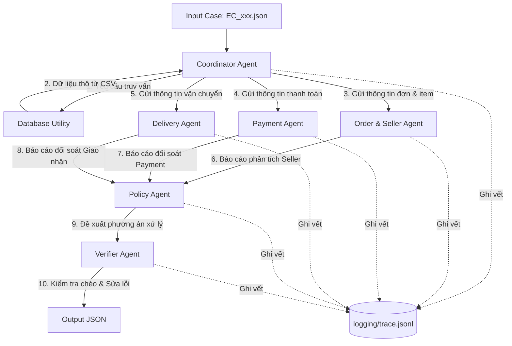

# Multi-Agent Dispute Resolution System Architecture

Tài liệu này mô tả sơ đồ kiến trúc hệ thống Multi-Agent được sử dụng để điều tra và tự động giải quyết các khiếu nại thương mại điện tử dựa trên dữ liệu Olist.

## 1. Sơ đồ các Agent (Agent Diagram)

Hệ thống được thiết kế theo mô hình **Coordinator-Workers** (Điều phối và Chuyên viên), kết hợp với một lớp **Verifier** (Kiểm chứng chất lượng) trước khi xuất kết quả.

---

## 2. Vai trò của từng Agent (Agent Roles)

| Tên Agent | Vai trò chính | Đầu vào (Input) | Đầu ra (Output) |
| :--- | :--- | :--- | :--- |
| **Coordinator Agent** | Nhận yêu cầu khiếu nại, kích hoạt Database Utility để truy xuất toàn bộ dữ liệu liên quan, điều phối các agent chuyên viên và tổng hợp luồng xử lý. | File `.json` khiếu nại của khách hàng. | Luồng điều hành và phân phối dữ liệu cho các agent khác. |
| **Order & Seller Agent** | Phân tích chi tiết thông tin đơn hàng và thời gian bàn giao của Seller. Xác định xem seller có giao hàng trễ cho đơn vị vận chuyển không. | Trạng thái đơn hàng, ngày đơn vị vận chuyển nhận hàng thực tế, và `shipping_limit_date` của từng sản phẩm. | JSON báo cáo trạng thái đơn hàng và danh sách các Seller bàn giao muộn. |
| **Payment Agent** | Đối soát số tiền khách hàng đã thanh toán thực tế với tổng giá trị sản phẩm và tiền cước vận chuyển. Phát hiện thanh toán chia nhỏ (split payment). | Danh sách các giao dịch thanh toán của đơn hàng và giá trị tiền sản phẩm + cước vận chuyển. | JSON đối soát chênh lệch dòng tiền và trạng thái split payment. |
| **Delivery Agent** | So sánh thời điểm giao hàng thực tế tới tay khách hàng với ngày dự kiến giao hàng ban đầu để phát hiện giao trễ do vận chuyển. | Ngày giao hàng thực tế (`order_delivered_customer_date`) và ngày dự kiến giao hàng (`order_estimated_delivery_date`). | JSON báo cáo việc đơn hàng có bị giao trễ hay không. |
| **Policy Agent** | Nhận toàn bộ báo cáo từ các agent chuyên môn, áp dụng bảng quy tắc nghiệp vụ `EC_POLICY_V1` để đưa ra kết luận về lỗi, bên chịu trách nhiệm, số tiền hoàn và hành động. | Báo cáo của các Agent chuyên môn và yêu cầu khiếu nại ban đầu. | Dự thảo phương án giải quyết (Primary issue, responsible party, refund, action). |
| **Verifier Agent** | Đóng vai trò kiểm tra chất lượng (QA). Đối chiếu đề xuất của Policy Agent với dữ liệu thô ban đầu để đảm bảo tính chính xác của các ID, số tiền, định dạng và giới hạn schema. | Phương án đề xuất từ Policy Agent và dữ liệu thô từ Database. | File JSON kết quả hoàn chỉnh đã được định dạng và kiểm chứng. |

---

## 3. Quyền truy cập dữ liệu (Data Access Permissions)

Để đảm bảo nguyên tắc an toàn dữ liệu và tối ưu hóa hiệu năng:
- **Database Utility**: Lớp tiện ích duy nhất được quyền đọc trực tiếp các file CSV của Olist. Lớp này tải dữ liệu vào bộ nhớ RAM và cung cấp API truy vấn nhanh theo `order_id`.
- **Specialist Agents (Order/Seller, Payment, Delivery)**: Chỉ được tiếp cận các phần dữ liệu đã được Coordinator trích xuất cụ thể cho nhiệm vụ của họ (Principle of Least Privilege).
- **Policy Agent**: Không đọc trực tiếp cơ sở dữ liệu gốc, chỉ làm việc trên các báo cáo tóm tắt cấu trúc từ các agent chuyên môn.
- **Verifier Agent**: Có quyền đọc dữ liệu thô từ Database Utility để thực hiện nhiệm vụ đối soát chéo (Double-check) số tiền và các ID liên quan.

---

## 4. Luồng Handoff Dữ liệu (Handoff Flow)

1. **Giai đoạn 1: Khởi tạo và Truy xuất (Ingestion & Retrieval)**
   - `CoordinatorAgent` đọc file khiếu nại, lấy ra `claimed_order_id`.
   - `CoordinatorAgent` gọi `OlistDB.get_order_details(claimed_order_id)` để lấy thông tin chi tiết.
2. **Giai đoạn 2: Phân tích song song/tuần tự (Specialist Analysis)**
   - `CoordinatorAgent` gửi dữ liệu đơn hàng & items cho `OrderSellerAgent`.
   - `CoordinatorAgent` gửi dữ liệu thanh toán & items cho `PaymentAgent`.
   - `CoordinatorAgent` gửi dữ liệu vận chuyển cho `DeliveryAgent`.
   - Ba Agent này xử lý độc lập và trả về kết quả phân tích dưới dạng JSON.
3. **Giai đoạn 3: Ra quyết định chính sách (Policy Decision)**
   - Kết quả phân tích được gom lại và chuyển cho `PolicyAgent`.
   - `PolicyAgent` phân tích các điều kiện logic để chọn dòng quy định tương ứng trong bảng chính sách, trả về đề xuất hoàn tiền và hành động.
4. **Giai đoạn 4: Kiểm chứng và Xuất bản (Verification & Output)**
   - `VerifierAgent` nhận đề xuất từ `PolicyAgent` kèm theo dữ liệu thô của đơn hàng.
   - Kiểm tra các ràng buộc:
     - Số lượng evidence IDs tối đa là 10.
     - Số tiền hoàn không vượt quá số tiền thanh toán thực tế của đơn hàng.
     - Định dạng của các ID khớp chuẩn (ví dụ: `item:<order_id>:<item_id>`).
   - Ghi file JSON kết quả vào thư mục `output/` và ghi vết toàn bộ quá trình trao đổi thông tin vào `logging/trace.jsonl`.
